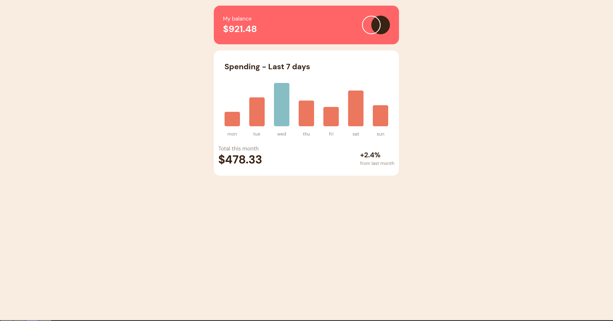

# Frontend Mentor - Expenses chart component solution

This is a solution to the [Expenses chart component challenge on Frontend Mentor](https://www.frontendmentor.io/challenges/expenses-chart-component-e7yJBUdjwt). Frontend Mentor challenges help you improve your coding skills by building realistic projects. 

## Table of contents

- [Overview](#overview)
  - [The challenge](#the-challenge)
  - [Screenshot](#screenshot)
  - [Links](#links)
- [My process](#my-process)
  - [Built with](#built-with)
  - [What I learned](#what-i-learned)
  - [Continued development](#continued-development)
  - [Useful resources](#useful-resources)
- [Author](#author)

## Overview

### The challenge

Users should be able to:

- View the bar chart and hover over the individual bars to see the correct amounts for each day
- See the current day’s bar highlighted in a different colour to the other bars
- View the optimal layout for the content depending on their device’s screen size
- See hover states for all interactive elements on the page
- **Bonus**: Use the JSON data file provided to dynamically size the bars on the chart

### Screenshot

### Links

- Solution URL: [solution URL here](https://github.com/KnightlyWorks/expenses-chart-component)
- Live Site URL: [live site URL here](https://KnightlyWorks.github.io/expenses-chart-component)

## My process

### Built with

- Semantic HTML5 markup
- Mobile-first workflow
- [Tailwind CSS(v4+)](https://tailwindcss.com/) - for styles <3
- JavaScript

### What I learned

I didn't quite learn it, but I understood the concept of `fetch` with **JSON**.

I discovered the convenience of Tailwind's `color/alpha` syntax (e.g., `bg-red-500/70`) for managing transparency without affecting child elements.

**Tooltip Implementation:** Initially attempted using `::after` pseudo-element, but encountered opacity inheritance issues when the parent element's opacity changed. I overcomplicated the solution by creating a separate DOM element for the tooltip. In hindsight, using `rgba()` for the parent's background instead of `opacity` would have been cleaner and allowed the `::after` pseudo-element to work independently. Lesson learned: reserve separate tooltip elements for cases where both `::before` and `::after` are already occupied! 😅

### Continued development

- Better understanding of CSS `opacity` vs `rgba()` for transparency control
- When to use pseudo-elements vs separate DOM elements

### Useful resources

- [Tailwind site](https://tailwindcss.com/) - Have amazing docs <3
- [Tailwind cheat sheet](https://tailwindcss.504b.cc/?ref=dailydev) - A very quick and easy-to-use cheat sheet for Tailwind v4.

## Author

- Frontend Mentor - [@KnightlyWorks](https://www.frontendmentor.io/profile/KnightlyWorks)
- Github - [@KnightlyWorks](https://github.com/KnightlyWorks)

